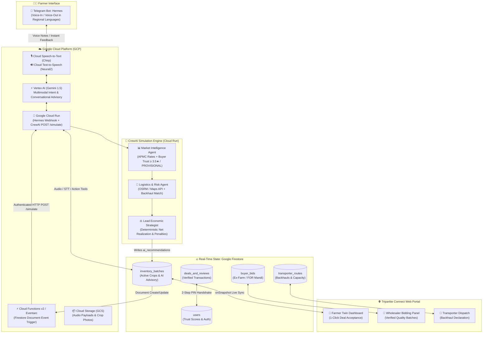
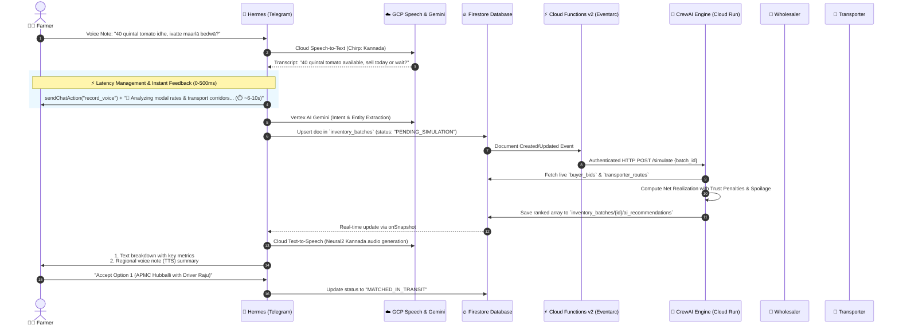

# **🌾 KisaanSathi (किसान साथी)**

### *AI-Driven Tripartite Multi-Agent Ecosystem for Eliminating Post-Harvest Agricultural Distress Selling*

---

## 📌 Executive Summary

India suffers an estimated **₹1.53 lakh crore (USD 18.5 billion)** in agricultural post-harvest losses annually. Smallholder and marginal farmers face a critical economic blind spot on harvest day: **they lack real-time data to calculate the true net realization of their crops across fragmented selling channels.**

**KisaanSathi** bridges this information vacuum through an AI-powered tripartite ecosystem that connects **Farmers**, **Buyers/Wholesalers**, and **Transporters** in a synchronized marketplace:

1. **Hermes (Farmer AI Co-Pilot):** A multimodal, voice-first assistant native to Telegram supporting regional Indian languages (Kannada, Hindi, Marathi, etc.) powered by Google Cloud Speech & Vertex AI Gemini with instant latency masking.
2. **Tripartite Connect Portal:** A real-time web exchange powered by Google Firebase/Firestore with role-tailored dashboards.
3. **CrewAI Multi-Agent Simulation Engine:** An intelligent backend task force executing deterministic economic models, risk-adjusted trust scoring, and dynamic logistics optimization hosted on Google Cloud Run via Eventarc / Cloud Function triggers.

---

## 📑 Table of Contents

1. [The Problem Statement](#1-the-problem-statement-the-post-harvest-distress-dilemma)
2. [Solution Architecture &amp; Tripartite Ecosystem](#2-solution-architecture--tripartite-ecosystem)
3. [Multi-Agent Task Force (CrewAI Backend)](#3-multi-agent-task-force-crewai-backend)
4. [End-to-End Workflow &amp; System Flow](#4-end-to-end-workflow--system-flow)
5. [Deterministic Economic Formulas &amp; Trust-Penalty Math](#5-deterministic-economic-formulas--trust-penalty-math)
6. [Horticultural Decay &amp; Benchmark Matrix](#6-horticultural-decay--benchmark-matrix)
7. [Shared State Engine: Firestore Data Architecture](#7-shared-state-engine-firestore-data-architecture)
8. [Hermes Conversational Interface &amp; Predefined Tools](#8-hermes-conversational-interface--predefined-tools)
9. [Lifecycle State Machine &amp; Anti-Gaming Verification](#9-lifecycle-state-machine--anti-gaming-verification)
10. [External APIs &amp; Offline Fallback Strategy](#10-external-apis--offline-fallback-strategy)
11. [Google Cloud Platform (GCP) Infrastructure &amp; AI Services](#11-google-cloud-platform-gcp-infrastructure--ai-services)
12. [Project Directory &amp; Component Layout](#12-project-directory--component-layout)

---

## 1. The Problem Statement: The Post-Harvest Distress Dilemma

```
                     ┌────────────────────────────────────────┐
                     │          HARVEST DAY DILEMMA           │
                     └───────────────────┬────────────────────┘
                                         │
                 ┌───────────────────────┼────────────────────────┐
                 ▼                       ▼                        ▼
      ┌──────────────────────┐┌──────────────────────┐┌──────────────────────┐
      │   Option A: Farmgate ││    Option B: APMC    ││ Option C: Cold Store │
      │   Immediate Cash     ││    Higher Gross Bid  ││ Speculative Delay    │
      │   ❌ Predatory Price ││    ❌ Freight & Tolls││ ❌ Rental Fees       │
      │   ❌ Distress Sale   ││    ❌ Perish Shrink  ││ ❌ Spoilage Risk     │
      └──────────────────────┘└──────────────────────┘└──────────────────────┘
```

* **The Net Realization Blind Spot:** Gross mandi prices appear attractive, but hidden transport tariffs, loading/unloading fees, mandi commissions, statutory cess, and transit decay often turn mandi trips into net losses compared to farmgate sales.
* **Deadhead Logistics & Empty Backhauls:** Transporters routinely return from city deliveries with empty trucks while nearby farmers struggle to find affordable freight.
* **Information Asymmetry & Counterparty Risk:** Buyers struggle to verify crop freshness and farmer reliability, while farmers face payment defaults and arbitrary quality deductions from unvetted middlemen.

---

## 2. Solution Architecture & Tripartite Ecosystem



### A. The Conversational AI Co-Pilot: Hermes (Farmer Frontend)

* **Native Telegram Deployment:** Zero installation barrier for farmers; open API permits dynamic outbound push notifications and alerts without WhatsApp's 24-hour template constraints or per-message fees.
* **Multimodal Voice-First:** Supports regional voice notes (Kannada, Hindi, Marathi, etc.) with Google Cloud Speech-to-Text (Chirp) and regional Text-to-Speech (Neural2) audio playback.
* **Passive Digital Identity:** Casual voice updates automatically populate and maintain the farmer's online profile, history, and inventory.

### B. The Tripartite Connect Web Portal

* **Farmer Dashboard:** Visual counterpart of Hermes showing ranked AI advisory cards with net profit breakdowns and one-click contract acceptance.
* **Wholesaler / Buyer Exchange:** Searchable crop marketplace with harvest timestamps, quality grades, and bidding with delivery toggles (*Ex-Farm* vs. *FOR Mandi*).
* **Transporter Dispatch Board:** Freight corridor matching, load clustering, and empty return declaration to monetize deadhead miles.

---

## 3. Multi-Agent Task Force (CrewAI Backend)

```
       ┌────────────────────────────────────────────────────────┐
       │             1. Market Intelligence Agent               │
       │  • Role: APMC & Direct Buyer Bid Analyst               │
       │  • Tool: Data.gov.in Mandi API + Cached Fallback       │
       │  • Constraint: allow_delegation=False                  │
       │  • Gate: Discard buyer bids where trust_score < 3.5    │
       │          UNLESS user_status == "PROVISIONAL"           │
       └───────────────────────────┬────────────────────────────┘
                                   │ Filtered Bids & Modal Prices
                                   ▼
       ┌────────────────────────────────────────────────────────┐
       │              2. Logistics & Risk Agent                 │
       │  • Role: Freight Dispatcher & Risk Auditor             │
       │  • Tool: Google Maps Routes API + OSRM Offline Fallback│
       │  • Constraint: allow_delegation=False                  │
       │  • Gate: Transporter trust & safety score mandated     │
       └───────────────────────────┬────────────────────────────┘
                                   │ Verified Routes & Freight Costs
                                   ▼
       ┌────────────────────────────────────────────────────────┐
       │              3. Lead Economic Strategist               │
       │  • Role: Chief Agricultural Economist (Decision Maker) │
       │  • Math: Deterministic Net Realization Formula         │
       │  • Constraint: allow_delegation=True                   │
       │  • Power: Rejects high-risk routes & delegates redo    │
       └────────────────────────────────────────────────────────┘
```

| Agent Name                          | Primary Responsibility                                                               | Input Feeds                                                    | Output Schema Requirements                                                           |
| :---------------------------------- | :----------------------------------------------------------------------------------- | :------------------------------------------------------------- | :----------------------------------------------------------------------------------- |
| **Market Intelligence Agent** | Audits buyer integrity, allows day-one onboarding, and aggregates APMC modal prices. | Data.gov.in API,`buyer_bids`, `users`                      | Array of valid bids with`buyer_trust_score` ($\ge 3.5\star$ or `PROVISIONAL`). |
| **Logistics & Risk Agent**    | Maps vehicle classes, calculates transit distances via Google Maps Routes API, and matches backhauls. | Google Maps Routes API (Primary) + OSRM (Fallback), `transporter_routes`, decay matrix | Valid routes with `freight_cost` and `transporter_trust_score`. |
| **Lead Economic Strategist**  | Calculates risk-adjusted net realization and compiles ranked recommendations.        | Filtered bids, route costs, decay metrics, statutory fee rules | Structured`ai_recommendations` array with `economic_rationale`.                  |

> [!TIP]
> **Day-One Onboarding Guard (`user_status == "PROVISIONAL"`):** To prevent day-one cold-start deadlocks where newly registered, unreviewed buyers are discarded by the $3.5\star$ filter, new verified buyers are designated as `PROVISIONAL` with a baseline provisional rating ($3.5\star$) until their initial 3 completed deliveries generate authentic community ratings.

---

## 4. End-to-End Workflow & System Flow



### ⏱️ Telegram Latency Management Strategy

Sequential multi-agent reasoning, external OSRM routing, and neural voice synthesis require **6 to 12 seconds** of compute:

1. **Immediate Chat Action (`sendChatAction`):** As soon as Hermes ingests the farmer's voice payload, it triggers `action="record_voice"` (or `"typing"`), signaling active system processing.
2. **Instant Micro-Acknowledgment:** Hermes immediately delivers an acknowledgment bubble:
   > *"🌾 Analyzing Agmarknet modal rates and local transport corridors for your 40 quintals of Tomatoes... (⏱️ ~6-10s)"*
   >
3. **Non-Blocking Delivery:** The backend processes asynchronously via Cloud Run; once Firestore is populated with the decision, Hermes streams the finalized text advisory and neural voice note seamlessly.

---

## 5. Deterministic Economic Formulas & Trust-Penalty Math

To prevent Large Language Model hallucinations in critical financial calculations, the Economic Agent computes net realization using strict deterministic formulas:

### 📐 1. Risk-Adjusted Net Realization ($NR$)

$$
\mathbf{NR = \text{Gross Revenue} - C_{\text{logistics}} - C_{\text{mandi}} - C_{\text{shrinkage}} - P_{\text{trust}}}
$$

Where:

$$
\text{Gross Revenue} = Q \times P_{\text{bid/modal}}
$$

* $Q$ = Crop Quantity (in Quintals)
* $P_{\text{bid/modal}}$ = Offered price per quintal (₹/qtl)

---

### 🚛 2. Dynamic Logistics Cost ($C_{\text{logistics}}$)

$$
C_{\text{logistics}} = \left( D \times T_{\text{base}} \times (1 - \delta_{\text{backhaul}}) \right) + L_{\text{labor}}
$$

* $D$ = Road distance calculated via OSRM / Google Routes (km)
* $T_{\text{base}}$ = Vehicle tariff per km (₹/km)
* $\delta_{\text{backhaul}}$ = Backhaul discount factor ($0.20 \text{ to } 0.35$ if empty return trip)
* $L_{\text{labor}}$ = Loading and unloading labor charges (₹)

---

### 🏛️ 3. Mandi Statutory & Handling Deductions ($C_{\text{mandi}}$)

*(Applied strictly when delivery term is `FOR_MANDI` or selling at APMC)*

$$
C_{\text{mandi}} = \text{Gross Revenue} \times (\tau_{\text{cess}} + \mu_{\text{commission}}) + (Q \times \omega_{\text{weighing\_hamali}})
$$

* $\tau_{\text{cess}}$ = Mandi Market Cess (typically $1.0\% - 2.0\%$)
* $\mu_{\text{commission}}$ = Commission agent statutory fee (typically $2.0\% - 2.5\%$)
* $\omega_{\text{weighing\_hamali}}$ = Hamali and weighing rate per quintal (₹/qtl)

---

### 🍅 4. Transit Shrinkage & Spoilage Cost ($C_{\text{shrinkage}}$)

$$
C_{\text{shrinkage}} = Q \times \left( \frac{D}{100} \times \sigma_{\text{crop}} \right) \times P_{\text{bid/modal}}
$$

* $\sigma_{\text{crop}}$ = Perishability decay percentage per 100 km (from Decay Reference Matrix)

---

### 🛡️ 5. Counterparty Trust Risk Penalty ($P_{\text{trust}}$)

To favor dependable buyers and careful transporters over risky low-rated parties:

$$
P_{\text{trust}} = P_{\text{buyer\_risk}} + P_{\text{transporter\_risk}}
$$

Where:

$$
P_{\text{buyer\_risk}} = \text{Gross Revenue} \times \max\left(0, \frac{5.0 - S_{\text{buyer}}}{5.0}\right) \times \kappa_{\text{buyer}}
$$

$$
P_{\text{transporter\_risk}} = \text{Gross Revenue} \times \max\left(0, \frac{5.0 - S_{\text{transporter}}}{5.0}\right) \times \kappa_{\text{transporter}}
$$

* $S_{\text{buyer}}, S_{\text{transporter}}$ = Historical Trust Scores ($1.0 \text{ to } 5.0$, with `PROVISIONAL` buyers assigned a baseline $3.5\star$)
* $\kappa_{\text{buyer}}$ = Buyer payment default risk weight (e.g., $0.05$)
* $\kappa_{\text{transporter}}$ = Transporter cargo damage risk weight (e.g., $0.04$)

---

## 6. Horticultural Decay & Benchmark Matrix

The Logistics and Economic Agents reference this standardized table for shrinkage and storage trade-offs:

| Commodity              | Ambient Shelf-Life | Max Cold Storage | Shrinkage Rate ($\sigma$) (% weight loss / 100 km) | Cold Storage Rental Rate (₹ / Quintal / Month) |
| :--------------------- | :----------------- | :--------------- | :--------------------------------------------------- | :---------------------------------------------- |
| **Tomato**       | 3 – 5 Days        | 21 Days          | 1.2% – 1.8%                                         | ₹110 – ₹130                                  |
| **Onion**        | 30 – 45 Days      | 180 Days         | 0.2% – 0.4%                                         | ₹75 – ₹90                                    |
| **Green Chilli** | 4 – 6 Days        | 28 Days          | 2.0% – 2.5%                                         | ₹130 – ₹150                                  |
| **Potato**       | 20 – 30 Days      | 240 Days         | 0.1% – 0.3%                                         | ₹80 – ₹100                                   |

---

## 7. Shared State Engine: Firestore Data Architecture

```
Firestore Root
│
├── 📂 users/{uid}
│     ├── role: "farmer" | "wholesaler" | "transporter"
│     ├── user_status: "PROVISIONAL" | "VERIFIED"
│     ├── name: string, email: string
│     ├── location: { village_or_district: "Hubballi" }
│     ├── trust_score: 4.8
│     └── completed_deals_count: 34
│
├── 📂 inventory_batches/{batch_id}
│     ├── farmer_id: "uid_123"
│     ├── crop: "Tomato", variety: "Vaishali", quantity_qtl: 40
│     ├── harvest_date: "2026-09-25T08:00:00Z"
│     ├── status: "PENDING_SIMULATION" | "LISTED_ACTIVE" | "MATCHED_IN_TRANSIT" | "FULFILLED"
│     └── ai_recommendations: [ { rank: 1, channel: "APMC_Hubballi", net_realization: 74200, ... } ]
│
├── 📂 buyer_bids/{bid_id}
│     ├── batch_id: "batch_456", buyer_id: "uid_789"
│     ├── offered_price_per_qtl: 2100
│     ├── delivery_term: "EX_FARM" | "FOR_MANDI"
│     └── buyer_trust_snapshot: 4.6
│
├── 📂 transporter_routes/{route_id}
│     ├── transporter_id: "uid_321"
│     ├── vehicle_type: "Tata 407 (3.5T)", capacity_qtl: 35
│     ├── origin: "Belagavi", destination: "Hubballi"
│     ├── is_backhaul: true, tariff_per_km: 14.5
│     └── transporter_trust_snapshot: 4.9
│
└── 📂 deals_and_reviews/{deal_id}
      ├── batch_id, farmer_id, buyer_id, transporter_id
      ├── agreed_price_per_qtl: number
      ├── status: "MATCHED" | "PICKUP_VERIFIED" | "FULFILLED"
      ├── verification_pins: { farmgate_otp: "4821", scale_otp: "9134", farmgate_verified: false, scale_verified: false }
      └── ratings: { farmer_to_buyer: 5, buyer_to_farmer: 4, farmer_to_transporter: 5 }
```

---

## 8. Hermes Conversational Interface & Predefined Tools

The Hermes Telegram gateway executes structured tool calls against the backend:

```
                  ┌─────────────────────────────────────────┐
                  │      Hermes Gateway Function Calls      │
                  └────────────────────┬────────────────────┘
                                       │
        ┌───────────────────┬──────────┴─────────┬───────────────────┐
        ▼                   ▼                    ▼                   ▼
┌──────────────────┐┌──────────────────┐┌──────────────────┐┌──────────────────┐
│ register_harvest ││ query_economic_  ││ accept_contract  ││ get_farmer_      │
│ _batch           ││ advisor          ││                  ││ profile          │
│ Ingests crop,    ││ Triggers Cloud   ││ Locks inventory, ││ Retrieves KYC,   │
│ quantity, date,  ││ Run simulation   ││ marks bid as     ││ village location,│
│ quality grade.   ││ workflow.        ││ ACCEPTED.        ││ & past history.  │
└──────────────────┘└──────────────────┘└──────────────────┘└──────────────────┘
```

---

## 9. Lifecycle State Machine & Anti-Gaming Verification

### A. Crop Batch Lifecycle

```
[DRAFT] ──► [PENDING_SIMULATION] ──► [LISTED_ACTIVE] ──► [MATCHED_IN_TRANSIT] ──► [FULFILLED]
```

### B. Anti-Collusion Digital Handshake (Two-Step PIN / OTP Verification)

To prevent fictitious review trading and rating inflation:

1. **Farmgate Pickup PIN:** Transporter arrives at farmgate $\rightarrow$ farmer provides PIN #1 $\rightarrow$ transporter verifies in app to confirm physical load custody.
2. **Mandi Delivery PIN:** Transporter arrives at buyer warehouse / Mandi scale $\rightarrow$ buyer weighs cargo and provides PIN #2 $\rightarrow$ transporter confirms delivery.
3. **Review Unlock:** Only after both PIN verifications succeed are review rating prompts unlocked for all three parties.

### C. System Edge Case Handlers

* **No Available Transporter:** If an APMC route is selected but no transporter claims the job within a set timeout, Hermes alerts the farmer and recalculates the best available *Ex-Farm* (Farmgate pickup) option.
* **Mandi Market Glut Alert:** If Agmarknet modal rates drop by $> 20\%$ week-on-week, the Economic Agent flags a **Glut Warning**, proactively recommending cold storage reservation or alternative distant mandis.

---

## 10. External APIs & Offline Fallback Strategy

| Feed Type                    | Provider & Endpoint                                                                                                   | Key Fields Utilized                                                                                    | Resiliency & Offline Fallback                                                                                        |
| :--------------------------- | :-------------------------------------------------------------------------------------------------------------------- | :----------------------------------------------------------------------------------------------------- | :------------------------------------------------------------------------------------------------------------------- |
| **Mandi Price Feed**   | **Data.gov.in OGD API**`https://api.data.gov.in/resource/9ef84268-d588-465a-a308-a864a43d0070`                | `state`, `district`, `market`, `commodity`, `variety`, `arrival_date`, `modal_price`     | If the API times out or rate limits, the Market Agent automatically falls back to local`cached_mandi_prices.json`. |
| **Distance & Routing** | **Google Maps Routes API** (Primary)<br/>`https://routes.googleapis.com/directions/v2:computeRoutes`<br/>*Fallback:* OSRM REST API | `routes[0].distanceMeters` ($\rightarrow$ km), `routes[0].duration` ($\rightarrow$ hrs) | Falls back to OSRM REST API and pre-computed inter-district distance lookup matrix if primary API is unreachable. |

---

## 11. Google Cloud Platform (GCP) Infrastructure & AI Services

KisaanSathi leverages Google Cloud Platform credits to deliver high-performance, enterprise-grade scalability, regional speech processing, and serverless compute:

```
┌────────────────────────────────────────────────────────────────────────────────────────┐
│                        GOOGLE CLOUD PLATFORM (GCP) ARCHITECTURE                        │
├──────────────────────────┬─────────────────────────────┬───────────────────────────────┤
│    AI & MULTIMODAL       │    COMPUTE & SERVERLESS     │      STORAGE & DATABASE       │
├──────────────────────────┼─────────────────────────────┼───────────────────────────────┤
│ • Vertex AI (Gemini 1.5) │ • Google Cloud Run          │ • Google Cloud Firestore      │
│   Intent extraction,     │   Containerized deployment  │   Real-time multi-client      │
│   multimodal voice reasoning│ for Hermes & CrewAI engine│   sync (onSnapshot)           │
│                          │                             │                               │
│ • Cloud Speech-to-Text   │ • Cloud Functions (v2) /    │ • Google Cloud Storage (GCS)  │
│   Chirp model for rural  │   Eventarc                  │   Secure audio voice notes &  │
│   regional Indian dialects│ Event-driven HTTP trigger   │ crop grade image archives     │
│                          │   (POST /simulate) on CloudRun│                               │
│                          │                             │                               │
│ • Cloud Text-to-Speech   │ • Artifact Registry         │ • Google Maps / Routes API    │
│   Neural2 regional voice │   Secure container image    │   Live road distance & toll   │
│   synthesis (KN, HI, MR) │   repository for deployments│   calculation backup          │
└──────────────────────────┴─────────────────────────────┴───────────────────────────────┘
```

### 🎯 Key GCP Service Integrations:

1. **Vertex AI (Gemini 1.5 Flash & Pro):**
   * Powers **Hermes' Multimodal Intelligence**: ingests mixed-language colloquial speech, identifies harvest intent, extracts quantities and crops, and formats conversational agricultural advice.
2. **Cloud Speech-to-Text (Chirp Model):**
   * Built on Google's 2B-parameter foundation model, delivering high recognition accuracy for Indian regional dialects (Kannada, Hindi, Marathi, Telugu, etc.) even with background rural acoustic noise.
3. **Cloud Text-to-Speech (Neural2 / Studio Voices):**
   * Generates natural, human-sounding localized audio notes explaining complex economic trade-offs to non-literate farmers.
4. **Google Cloud Run (HTTP Scale-to-Zero):**
   * Hosts the `hermes-bot` webhook service and the `crewai-engine` execution service in fully-managed, auto-scaling serverless containers (scaling to zero when idle to conserve cloud credits).
5. **Eventarc & Cloud Functions (v2) Decoupling:**
   * Eliminates CPU throttling and dangling connection traps. Whenever an `inventory_batches` document is created/updated with `status == "PENDING_SIMULATION"`, Cloud Functions v2 dispatches an authenticated HTTP `POST /simulate` to the Cloud Run `crewai-engine` container.
6. **Cloud Firestore & Firebase Authentication:**
   * Provides real-time synchronization between the web portal and mobile bot, paired with Google Sign-In / Email authentication for frictionless, cost-free user authentication.
7. **Google Cloud Storage (GCS):**
   * Stores encrypted farmer voice recordings, mandi receipt images, and crop quality photographs with time-limited signed URLs.

---

## 12. Project Directory & Component Layout

```
KisaanSaathi/
├── README.md                          # Comprehensive Architectural Specification
├── apps/
│   ├── hermes-bot/                    # Telegram Multimodal Bot (Voice In/Out)
│   │   ├── src/
│   │   │   ├── bot.py                 # Telegram Webhook & Latency Handlers
│   │   │   ├── speech_service.py      # GCP Speech-to-Text (Chirp) & Text-to-Speech
│   │   │   ├── vertex_ai_client.py    # Vertex AI Gemini Multimodal Reasoner
│   │   │   └── tools.py               # Hermes Firestore Integration Tools
│   │   ├── Dockerfile                 # Cloud Run Container Config
│   │   └── requirements.txt
│   │
│   ├── crewai-engine/                 # Multi-Agent Simulation Taskforce (Cloud Run)
│   │   ├── src/
│   │   │   ├── api.py                 # FastAPI Endpoint: POST /simulate
│   │   │   ├── agents.py              # Market, Logistics & Economic Agents
│   │   │   ├── tasks.py               # Crew Tasks & Schema Enforcements
│   │   │   ├── formulas.py            # Deterministic Net Realization Math
│   │   │   └── simulation_runner.py   # Multi-Agent Simulation Orchestrator
│   │   ├── Dockerfile                 # Cloud Run Container Config
│   │   └── requirements.txt
│   │
│   ├── functions/                     # GCP Cloud Functions v2 / Eventarc Trigger
│   │   ├── main.py                    # Firestore Event Listener -> POST /simulate Dispatcher
│   │   └── requirements.txt
│   │
│   └── web-portal/                    # Tripartite Connect Real-time Web App
│       ├── public/
│       ├── src/
│       │   ├── components/            # Farmer, Buyer & Transporter Dashboards
│       │   ├── services/firebase.js   # Firestore Listeners & Auth
│       │   └── App.jsx
│       └── package.json
│
├── data/
│   ├── cached_mandi_prices.json       # Offline Mandi Fallback Data
│   └── horticultural_decay.json       # Spoilage & Shrinkage Matrix
└── config/
    ├── firebase_config.json           # Firebase Service Account & Config
    └── gcp_credentials.json           # GCP Vertex AI / Speech Service Credentials
```

---

<div align="center">
  <sub>Built with ❤️ for Indian Farmers • Powered by Google Cloud & Multi-Agent AI</sub>
</div>
